##Gestão de S.O
###Professor Gustavo Montanha gmontanha@gmail.com

------------------------------------------------
#11/02/2015

### AULA 1

- #### Processos
- #### BCP
- #### Estados de Processos

------------------------------------------------
#### 1. INTRODUÇÃO
A gerência de um ambiente multiprogramável é função exclusiva do sistema operacional que deve controlar a execução dos diversos programas e o uso concorrente dos recursos. Para isso um programa para ser executado deve estar sempre associado a um processo. 

#### 2. PROCESSO
-> Programa em execução ?

-> Conjunto de informações necessárias para que o S.O implemente a concorrência entre os programas.

-> O S.O não executa somente o programa que visualizamos e sim seus diversos comandos e instruções via processos.

-> Todos os softwares que podem ser executados em um computador, inclusive o S.O em alguns casos, são organizados em vários processos.

Exemplo de ambientes de Processos: 
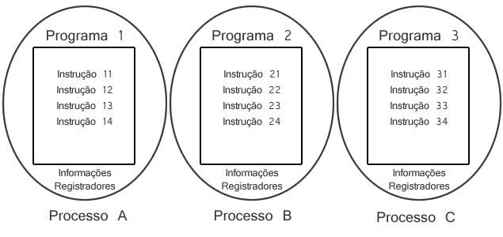
>#####Quando uma instrução é interrompida um registrador específico grava o endereço de memória de onde a instrução foi interrompida para quando retornar a este ambiente ele saber de qual instrução continuar executando.

#### 2.1 DEFINIÇÃO DE PROCESSO
Ambiente onde programas são executados, sendo que para sua especificação completa, deve-se incluir o próprio programa a ser executado como outras informações tais como valores de variáveis, registradores, contador de programa e outros necessários para definição completa de seu estado.

#### 2.2 EXEMPLO

Processador  -  Programa  -  Dados  -  Processo
 		?							 ?					 ?					?

>######Um cientista está preparando um experimento para sua empresa. Ele possui um manual do experimento, um laboratório equipado com todas as ferramentas tais como: Anéis de alumínio, fitas de vedação e componentes químicos.

#### 3. BCP - Bloco de Controle de Processo (PCB - Process Control Block)
Todos os processos são implementados pelo S.O através da estrutura BCP. A partir do BCP o S.O mantém todas informações necessárias para sua execução.

#### 3.1 Contexto de Software
- São especificadas características e limites dos recursos que podem ser alocados pelos processos como por exemplo nº máximo de arquivos abertos, prioridades de execução, etc.

- Muitas dessas características são determinafdas no momento da criação do processo enquanto outras podem ser alteradas durante sua existência. 

- Composto por 3 grupos de informações 
  - IDENTIFICAÇÃO
    - Cada processo criado recebe um identificação única (PID - Process Identification).
   	- Identificação do usuário (UID - User Identification) atribuída ao processo no momento de sua criação.

  - QUOTAS: São os limites de cada recurso do sistema que um processo pode alocar como por exemplo: Tamanho máximo de memória, número máximo de operações de E/S, etc.

  - PRIVILÉGIOS: Definem as ações que o processo pode fazer em relação a ele mesmo e outros processos.

#### 3.2 Contexto de Hardware
- Armazena o conteúdo dos registradores gerais e específicos da CPU
- Exemplo de Registradores:
	- REGISTRADOR PC: é o registrador contador de programa que indica o endereço na memória da próxima instrução a ser executada
	
	- REGISTRADOR PSW: Que fornece informações sobre a execução da instração e o estado do sistema em relação ao programa em execução 

#### 3.3 Contexto de Endereçamento
 - É a área de memória pertinente ao processo onde as instruções e os dados do programa são armazenados para execução.

 - Cada processo possui seu próprio espaço de endereçamento que deve ser protegido do acesso aos demais processos.

 
*Exemplo dos três Contextos citados acima*

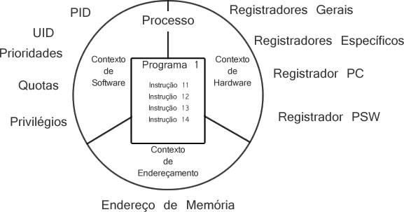

####Exercício

1. Por que o conceito de processo é tão importante no projeto de sistemas operacionais multiprogramáveis?
2. O que é contexto de Hardware no processo? E como funciona a implementação da troca de contexto?
3. Qual a função do contexto de Software? Cite e explique uma informação importante de cada grupo.
4. Defina processo.

------------------------------------------------
#25/02/2015

###AULA3
 - ESTADOS DE PROCESSOS
 - PROCESSOS INDEPENDENTES, SUB-PROCESSOS E THREADS
 - PROCESSOS CPU-BOUND     IO/BOUND

##ESTADOS DE PROCESSOS 
Durante a sua existência, os processos podem se apresentar em diferentes estados.
 - Criação (New)
 - Pronto (Ready)
 - Execução (Running)
 - Espera (Waiting)
 - Terminado (Exit)

####Criação:
Nesse estado o S.O crou seu BCP mas não pôde colocá-lo na lista de pronto.

####Pronto:
Um processo está pronto quando aguarda apenas para ser executado pela CPU(contexto de Software).

####Execução:
Momento em que efetivamente o processo usa a CPU.

####Espera:
Estão todos processos que sofreram algum tipo de interrupção(E/S).

####Terminado:
Não pode mais ter nenhum programa executado em seu contexto. O término pode ocorrer por razões como: 
 - Término normal de execução;
 - Eliminação forçada;
 - Ou eliminação por outro processo;

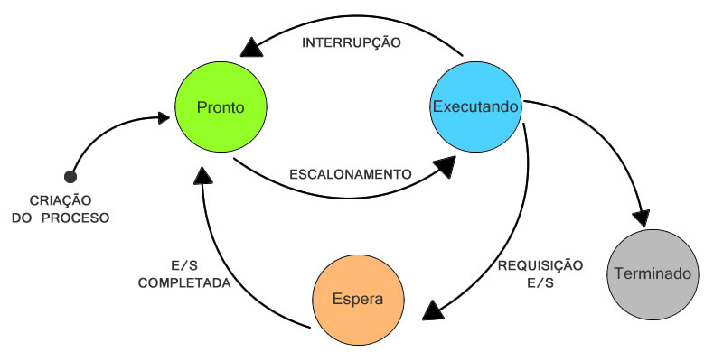

##Mudança de Estado de Processos
 - Criação - Pronto
 - Pronto - Execução
 - Execução - Pronto
 - Execução - Espera
 - Espera - Pronto
 - Execução - Terminado

####Criação - Pronto
O processo foi criado, tem seus recursos alocados, está apto a fazer uso da CPU de acordo com o **Escalonamento**.  

####Pronto - Execução
O processo é o primeiro da fila de pronto e a CPU fica disponível para sua execução.

####Execução - Pronto
O processo foi interrompido pela determinação da sua fatia de tempo ou prioridade.

####Execução - Espera
Essa transição acontece quando o processo foi interrompido por **Entrada/Saída** ou eventos externos.

####Espera - Pronto
Um processo está em Esprera, passa para Pronto quando a operação de **Entrada/Saída** solicitada é atendida. Um processo em Espera terá sempre que, passar para Pronto antes de ser novamente executado.

####Execução - Terminado
Nesta mudança o processo não mais disputará o uso da CPU. 

##PROCESSOS INDEPENDENTES
Maneira mais simples de implementar a concorrência não existindo vínculo do processo criado com seu criador.

##SUBPROCESSOS
São processos criados a partir de um processo pai dentro de uma estrutura hierárquica. Os subprocessos, assim como os processos independentes, possuem sua própria BCP.

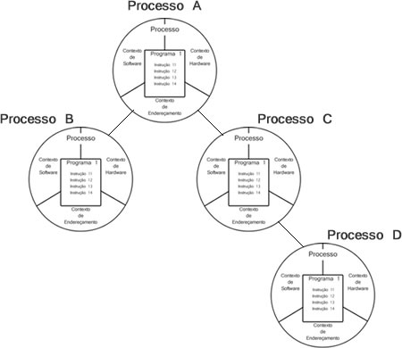

##Problemas
 - Uso de processos independentes e subprocessos demanda consumo de recursos do sistema.
 - Sempre que um processo é criado o sistema aloca a BCP(Bloco de Controle de Processo), consumindo tempo da CPU.
 - Falta de eficiência na comunicação entre processos.

##Threads
Surgiu na tentativa de reduzir o tempo gasto na criação, eliminação e comunicação de processos.
Neste ambiente um único processo pode suportar **Múltiplos Threads**.
Cada thread possui seu próprio contexto de hardware, porém compartilham o mesmo contexto de software e espaço de endereçamento.

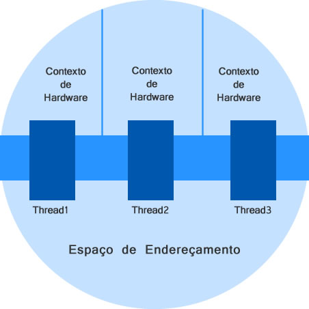

###Processos Foreground X Background

 a - Foreground - permite comunicação direta entre usuário e processo.
 b - Background - não existe a comunicação direta processo-usuário

###Processos CPU-Bound X I/O Bound

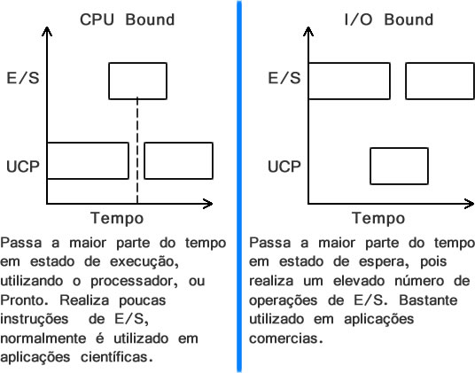

------------------------------------------------
#04/03/2015 - 11/03/2015

####Dica de programa para baixar: SOSIM

##Threads

###1. Introdução
Até o final da década de 70, sistemas operacionais suportavam apenas processos com uma única thread.

1979: surgimento de processos light-weight onde o espaço de endereçamento era compartilhado com vários programas.

1980: viabilidade com sistema operacional Mach (clara separação entre processo e thread).

Hoje um processo pode ter partes diferentes de seu código sendo executados em paralelo e como as threads ocupam o mesmo espaço de endereçamento do processo, melhora-se seu desempenho.

###2. Ambiente MonoThread

Um processo suporta apenas um programa em seu espaço de endereçamento.
A concorrência existe apenas entre processo e subprocessos acarretando maior demanda por recursos do sistema principal na criação de novo processo.

As primeiras versões do Windows são exemplos de sistemas operacionais monothreads.

###3. Ambiente MultiThread
Um processo tem uma thread em execução mas pode compartilhar seu espaço de endereçamento com outras threads.
Thread: pode ser definido como uma subrotina de um programa que pode ser executada de forma assíncrona e concorrente dentro de um processo.
Vantagem desse ambiente é minimizar alocação de recursos e diminuir o overhead (criação, troca e eliminação de processos).
Threads compartilham o processador da mesma maneira que os processos e são implementados pela TCB (Thread Control Block). 

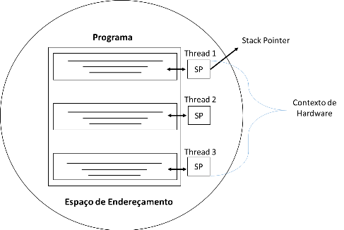

####3.1Exemplo 1
X:= SQRT (1024) + (35.4 * 023) – (302/7)
Program Expressao
Var x, t1, t2, t3 : Real;
Begin
	ParaBegin
		T1:= SQRT (1024);
		T2:= 35.4  * 0.23;
		T3:= 302/7;
	ParaEnd;
	X:= T1+T2+T3;
	Write (x);
End

####3.2 Exemplo 2
Latência entre processos e threads segundo Vahalia (1996)
Implementação	Tempo de Criação 
(Micro segundos)	Tempo de Sincronização (Micro Segundos)
Processo	1700	200
Lightweight	350	390
Thread	52	66

###4. Arquitetura

####4.1Threads em Modo Usuário
Threads em modo usuário (TMU) são implementados pela aplicação e não pelo sistema operacional.
Nesse modo, o S.O não sabe da existência de múltiplos threads, sendo responsabilidade exclusiva da aplicação gerenciá-los.

#####4.1.1 Vantagens
A vantagem do TMU é a possibilidade de implementar aplicações multithread mesmo em S.O que não suportam threads.
São rápidos por dispensar o acesso ao Kernel do S.O evitando a mudança de modo de acesso (usuário – Kernel – Usuário).
#####4.1.2 Desvantagens
A desvantagem é que não é possível que múltiplos threads sejam executados em diferentes CPUs simultaneamente pois o S.O enxerga apenas o processo e não múltiplos threads.

####4.2 Threads em Modo Kernel
TMK, são implementados diretamente pelo núcleo do S.O que conhece a existência de cada thread e como escaloná-lo. 
#####4.2.1 Vantagens
No caso de múltiplos processadores, as threads de um mesmo processo podem ser executadas simultaneamente.
#####4.2.2 Desvantagens 
A desvantagem é seu baixo desempenho pela constante troca de modo de acesso (Usuário – Kernel - Usuário).

Implementação	Operação 1
(Micro segundos)	Operação 2
(Micro Segundos)
Subprocessos	11300	1840
TMK	948	441
TMU	34	37

####4.3 Threads em Modo Híbrido
A arquitetura de threads em modo híbrido combina as vantagens de threads implementados em Modo Kernel e Modo Usuário.
Um processo pode ter várias TMK e, por sua vez, várias TMU.
O modo Híbrido, apesar de maior flexibilidade, apresenta problemas herdados de ambas implementações.
Quando um TMK realiza uma chamada à rotina do sistema, todos TMU são colocados em modo (estado) de espera.

####4.4 Scheduler Activations
Os problemas apresentados no pacote de thread em modo híbrido existem devido à falta de comunicação entre os TMK e TMU. O modelo ideal deveria mesclar as facilidades do TMK com o desempenho do TMU.
O Scheduler Activitions combina o melhor das duas arquiteturas, mas em vez de dividir os threads em modo usuário e Kernel, o núcleo do sistema troca informações com a biblioteca de threads utilizando essa arquitetura.
A maneira de se obter o melhor desempenho é evitar as mudanças de modos de acesso desnecessários. Isso é possível porque a biblioteca em TMK e TMU se comunicam e trabalham de forma cooperativa.

------------------------------------------------
#18/03/2015

####Gerência do processador
 - Introdução
 - Funções Básicas
 - Critérios de Escalonamento
 - Tipos de Escalonamento
 - Exercícios

###Introdução
A gerência do processador tornou-se indispensável tendo em vista o surgimento de S.O multiprogramáveis.

Considerando que muitos processos estão no estado de pronto, deve-se escolher o próximo para fazer uso do processador.

Para isso, na **Política de Escalonamento**, por meio de políticas, algoritmos e mecanismos que podem realizar o gerenciamento do processador.

###Funções Básicas
 - Manter o processador ocupado maior parte do tempo possível.
 - Balancear o suo do processador entre os diversos processos.
 - Privilegiar processos e aplicações importantes.

#####Observações:
> - ######Cada tipo de S.O possui sua própria política de escalonamento.
  - ######Assim, sistemas de tempo real possui necessidades de escalonamento diferentes, de sistemas de tempo compartilhado.

###Critérios de Escalonamento

#####1. Utilização do Processador
A ideia é ocupar o processador a maior parte do tempo. Um sistema com uso na faixa de 30% indica baixa carga de utilização ao passo que um sistema com faixa de 90% indica um sistema próximo da sua capacidade máxima.

#####2. Throughput
Representa o número de processos executados em um determinado intervalo de tempo. Quanto maior o indicador de Throughput, maior o número de tarefas executadas em função do tempo.

#####3. Tempo de Processador
Tempo que um processo leva no estado de execução durante seu processamento. As políticas de escalonamento não influenciam no tempo de processamento de um processo.

#####4. Tempo de Espera
É o tempo total que um processo permanece na fila de pronto aguardando para ser executado. Quanto menor o tempo melhor a eficiência no escalonamento.  

#####5. Tempo de Turnaround
É o tempo que um processo leva da sua criação ao término, levando em conta todo o tempo gasto na espera, fila de pronto, processamento e fila de espera.

#####6. Tempo de Resposta
É o tempo recorrido da requisição no sistema e o instante que a resposta é apresentada. Não se limita a capacidade de processamento tendo em vista a relação com dispositivos de E/S.

###Tipos de Escalonamento

####Escalonamentos Não-Preemptivos e Preemptivos
Classificação segundo a capacidade de um S.O de interromper um processo em execução e substituí-lo pro outro(preempção).

####1. Não-Preemptivos
 - Primeiro tipo de escalonamento implementado em S.O multiprogramados.
 - Quando um processo está em execução, nenhum outro evento externo pode ocasionar a perda do uso do processador.

####2. Preemptivos
 - Permite que o processo em execução seja interrompido alocando assim um outro processo ou evento.
 - Permite priorizar processos, aplicável em sistemas operacionais modernos.
 - Permite o uso de políticas de escalonamento para melhor balancear o uso do processador.

###First-In First-Out(FIFO)
O processo que primeiro chegar em estado de pronto é o selecionado para execução.

Possui algoritmo simples, com necessidade de fila, onde os processos que possam para estado de pronto entram no fim da fila e são escalonados quando chegar no seu início.

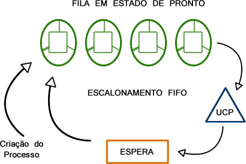

------------------------------------------------

Imagem de Exemplo

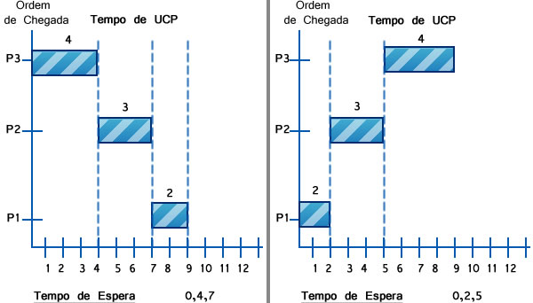

#####Baseando-se na imagem abaixo, responda as seguintes perguntas:

 1. Qual exemplo possui o melhor escalonamento? Justifique-o relacionando com o critério mais adequado:
 >O segundo exemplo, pois .

 2. Ambos são FIFO? Porquê?
 > Sim, ambos utilizam o fato de que o primeiro processo a chegar é o primeiro a ser executado.
 

#####Desvantagens do FIFO
 - Impossibilidade de prever quando um processo terá sua execução iniciada;
 - O algoritmo não se preocupa em melhorar o tempo médio de espera dos processos, utilizando apenas a ordem de chegada dos mesmos
 - Processos CPU-Bound tem vantagens em relação aos processor I/O-Bound

O escalonamento FIFO apresenta-se na maior parte das situações de forma ineficiente na gerência do processador. O escalonamento não preemptivo limita sua aplicação em sistemas atuais de tempo compartilhado.

----------------------------------------------------------------------
#25/03/2015

>####25/03/2015 - Análise e Apresentação de Artigo(em grupo)
>####01/04/2015 - Lista de Exercícios para Revisão
>####08/01/2015 - P1

###Texto
 1. Trabalho Escrito
 2. Trabalho Apresentado

---------------------------------------------------------------------
#01/04/2015
###Lista de Revisão

####1. Defina Processo
>Ambiente onde programas são executados, sendo em seu escopo deve-se incluir o próprio programa a ser executado, assim como outras informações, tais como: valores de variáveis, registradores, contador de programa e outros necessários para definição completa de seu estado.

####2. Explique o Contexto de Software e seus componentes.
>

####3. Explique o Contexto de Hardware e seus componentes.
>

####4. Explique o Espaço de Endereçamento e seus componentes.
>

####5. Explique a importância do Contexto de Hardware no escalonamento.
>

####6. Explique o mecanismo de funcionamento entre os processos em espera, executando e pronto.
>

####7. Defina subprocesso e thread.
>

####8. Cite Vantagens do ambiente MultiThread.
>

####9. O que é Politica de Escalonamento?
>

####10. Cite algumas funções da gerência de processador. 
>

####1. Defina Processo
>

####1. Defina Processo
>

####1. Defina Processo
>

####1. Defina Processo
>

####1. Defina Processo
>

####1. Defina Processo
>

####1. Defina Processo
>

####1. Defina Processo
>

####1. Defina Processo
>

---------------------------------------------------------------------
#22/04/2015
###SJF(Shortest Job First) - Não Preemptivo

É a política de escalonamento na qual o processo que possuir menor tempo de utilização do processador é selecionado primeiramente para execução.

###SRTF(Shortest Remaining Time First) - Preemptivo

###Escalonamento por Prioridade
Onde os processos possuem diferentes prioridades de execução, os de maior prioridade são escalonados preferencialmente.

Algoritmos são implementados mediante a um clock, que interrompe o processador, escalonando outro processo se necessário.

####Prioridade
 Estática: Não é modificada durante a existência do processo.

 Dinâmica: Pode ser modificada durante a execução do processo. 

---------------------------------------------------------------------
#29/04/2015

###Gerenciamento do Processador

- ##FIFO
- ##SJF
- ##Cooperativo
- ##Circular
- ##Circular Virtual
- ##Circular com Prioridades
- ##Múltiplas Filas
- ##Múltiplas Filas com realimentação.

- - -

###Escalonamento Cooperativo
. Busca aumentar o grau de multiprogramação em políticas de escalonamento não-preemptivos.
. Um processo em execução pode voluntariamente liberar o processador voltando para a fila de pronto.
. Essa liberação ocorre exclusivamente pelo processo em execução e não pelo S.O.

** Desvantagem:** - Caso não verifique a fila de mensagens( que determina e existem outros processos na fila de pronto), os demais não terão chance de serem executados até a liberação da UCP pelo processo em execução.

** Vantagem: ** - possibilidade de liberação da UCP permitindo melhor distribuição e uso do processador em sistemas não-preemptivos (primeiras versões do Win).

###Escalonamento Circular
. É um tipo de escalonamento preemptivo projetado para sistemas de tempo compartilhado.
. Possui semelhança ao **FIFO** mas quando um processo passa para o estado de execução tem uma fatia de tempo(time-slice) para uso do processador.
. O valor da fatia de tempo depende da arquitetura de cada SO(10 a 100 ms), que afeta a política e desempenho do escalonamento.

** Desvantagem: ** - para time-slices pequenos existe um grande número de preempções e muitas trocas de contextos prejudicando dessa forma o desempenho do ssitema.

** Vantagem: ** - não permite a monopolização da UCP. O tempo máximo de uso será determinado pela fatia de tempo.

 
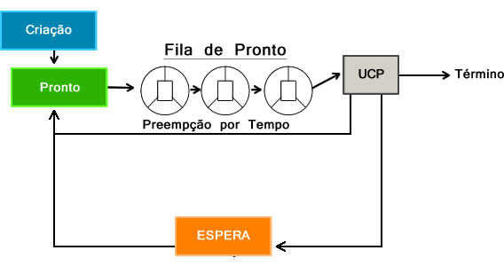
 

###Escalonamento Circular Virtual
. Esse escalonamento apresenta-se como um refinamento do circular buscando reduzir suas deficiências.
. Apesar da sua maior complexidade de implementação, resultados comprovam um melhor balanceamento de uso do processador.

 
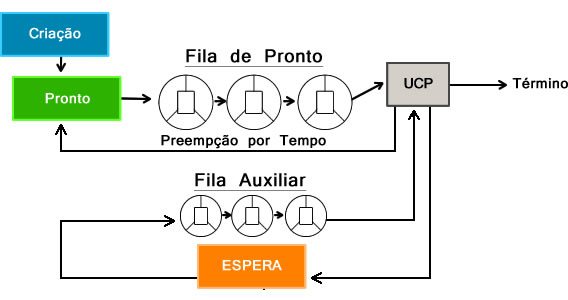
 

###Circular com Prioridades
. Implementa de forma conjunta o conceito de time-slice com prioridades.
. Um processo permance em execução até que: termine seu tempo de processamento, voluntariamente passe para estado de espera ou sofra uma preempção por tempo ou prioridade.
. Amplamente utilizado em sistemas de tempo compartilhado permitindo melhor balanceamento da UCP e diferenciação do grau de importância dos processos.
 
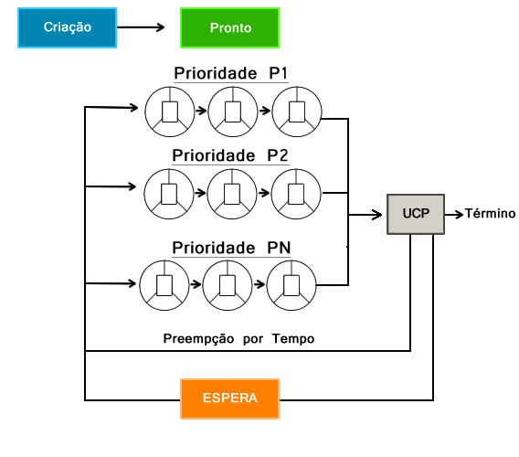
 

###Múltiplas Filas
. Nesse escalonamento existem diversas filas de processos em estado de pronto, cada qual com uma prioridade específica.
. Os processos são selecionados para as filas de acordo com características de cada uma como importância da aplicação, tipo de processamento, alocação em memória dentre outros.
. O processo em execução sofre preempção caso um outro processo entre em uma fila de maior prioridade.
. Esse escalonamento permite a conveniência de diferentes mecanismos de escalonamento em um mesmo SO.

###Multiplas Filas com Realimentação
. Semelhante ao escalonamento anterior, contudo os processos podem trocar de fila durante seu processamento.
. Sua principal vantagem é permitir ao sistema operacional identificar dinamicamente o comportamento de cada processo e direcioná-lo para a fila mais adequada ao longo do seu processamento.
. Um mecanismo FIFO adaptado com fatia de tempo implementado em todas as filas exceto a de menor prioridade que utiliza o escalonamento circular.
. A fatia de tempo de cada fila varia em função da sua prioridade, ou seja, quanto maior a prioridade, menor a fatia de tempo.

 
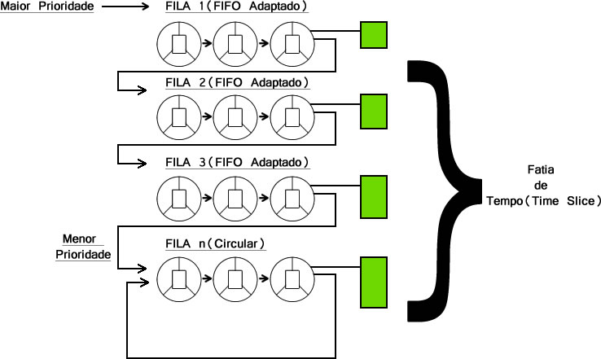
 

