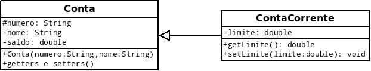
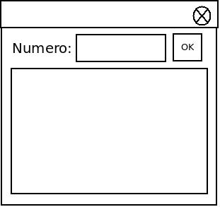
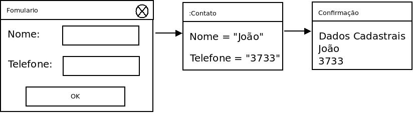

#Anotações da Aula de OOP

####20/08/2014

### Conversões em JAVA


#### String para Int

Integer.parseInt();


#### String para Double

Double.parseDouble();


Objeto  = Dados + código


###Wrappers(Classes que armazenam um tipo primitivo)

byte -> Byte
short -> Short
int -> Integer
long -> Long
float -> Float
double -> Double
char -> Character
boolean -> Boolean


=========================================


####03/09/2014

### Uso de Datas

####Classes Date, Calendar e GregorianCalendar


    import java.util.*;
    public class UsandoDatas{
      public static void main(String[] args){
        Date momento = new Date();
        System.out.prointln("Exibição de um objeto Date: " + momento);

        GregorianCalendar data = new GregorianCalendar();
        int dia = data.get(Calendar.DAY_OF_MONTH);
        int mes = data.get(Calendar.MONTH);
        int ano = data.get(Calendar.YEAR);
        int diaSemana = data.get(Calendar.DAY_OF_WEEK);
        int hora = data.get(Calendar.HOUR_OF_DAY);

        System.out.println("Data: " +dia+ "/" + (mes+1) + "/" + ano);
        System.out.println("Dia da semana: " + diaSemana);
        System.out.println("Hora: " + hora);
      }
    }


###Exercício

####1. Com base no horário do sistema, exibir uma mensagem de saudação do tipo: Boa noite, Quarta-feira, 3 de setembro de 2014.


    import java.util.*;
    public class UsandoDatas{
      public static void main(String[] args){
        Date momento = new Date();
        System.out.println("Exibição de um objeto Date: " + momento);

        GregorianCalendar data = new GregorianCalendar();
        int dia = data.get(Calendar.DAY_OF_MONTH);
        int mes = data.get(Calendar.MONTH);
        int ano = data.get(Calendar.YEAR);
        int diaSemana = data.get(Calendar.DAY_OF_WEEK);
        int hora = data.get(Calendar.HOUR_OF_DAY);

        System.out.println("Data: " +dia+ "/" + (mes+1) + "/" + ano);
        System.out.println("Dia da semana: " + diaSemana);
        System.out.println("Hora: " + hora);


        String msg = "";

        if(hora < 12){
          msg = "Bom dia, ";
        }
        else if(hora < 18){
          msg = "Boa tarde, ";
        }
        else{
          msg = "Boa noite, ";
        }


        String[] diasDaSemana = {"", "Dom", "Seg", "Ter", "Qua", "Qui", "Sex", "Sab"};
        String[] meses = {"Jan", "Fev", "Mar", "Abr", "Mai", "Jun", "Jul", "Ago", "Set", "Out", "Nov", "Dez"};
        msg += diasDaSemana[diaSemana] + ", ";
        msg += (dia < 10) ? "0"+dia : dia;
        msg += " de " + meses[mes] + " de " + ano;
        System.out.println(msg);


      }
    }


####2. Dado um número natural inteiro com no máximo três algarismos, exibir seu extenso. (0-999);


    import java.util.*;

    import javax.swing.JOptionPane;
    public class DescricaoNumeros{
      public static void main(String[] args){

        String[] diasDaSemana = {"", "Dom", "Seg", "Ter", "Qua", "Qui", "Sex", "Sab"};
        String[] meses = {"Jan", "Fev", "Mar", "Abr", "Mai", "Jun", "Jul", "Ago", "Set", "Out", "Nov", "Dez"};
        msg += diasDaSemana[diaSemana] + ", ";
        msg += (dia < 10) ? "0"+dia : dia;
        msg += " de " + meses[mes] + " de " + ano;
        System.out.println(msg);

        String numero = JOptionPane.showInputDialog("Digite qualquer numero inteiro");

        int n = Integer.parseInt(numero);

        String[] unidade = {"Zero", "Um", "Dois", "Tres", "Quatro", "Cinco", "Seis", "Sete", "Oito", "Nove" , "Dez", "Onze", "Doze", "Treze", "Quatorze", "Quinze", "Dezesseis", "Dezessete", "Dezoito", "Dezenove"};
        String[] dezena = {"", "", "Vinte", "Trinta", "Quarenta", "Cinquenta", "Sessenta", "Setenta", "Oitenta", "Noventa"};
        String[] centena = {"", "Cento", "Duzentos", "Trezentos", "Quatrocentos", "Quinhentos", "Seissentos", "Oitocentos", "Novecentos"};

        if(n == 100){
          JOptionPane.showMessageDialog(null, "Cem");
        }
        else
        {
            int u = n % 10;
            int d = n %100 / 10;
            int c = n / 100;
          if(d == 1){
            d = 0;
            u+=10;
          }

          String num1 = "";
          if( c > 0 && (d > 0 || u > 0) )
            num1 += centena[c] + " e ";
          if(d > 0)
            num1 += (u > 0) ? dezena[d] + " e ": dezena[d];

          if(u > 0)
            num1 += unidade[u];

          JOptionPane.showMessageDialog(null, num1);
        }


      }
    }


####3. Dado um valor monetário entre R$ 0,00 e R$ 999.999.999,99, exibir seu extenso.

    public class Extenso{

        public static String parte(int n){
            String numero = JOptionPane.showInputDialog("Qual o numero?");
            int n = Integer.parseInt(numero);
            String[] unidades = {"zero", "um", "dois", "tres", "quatro", "cinco", "seis", "sete", "oito", "nove", "dez", "onze", "doze", "treze", "quatoze", "quinze", "dezeseis", "dezesete", "dezoito", "dezenove"};
            String[] dezenas = {"", "", "vinte", "trinta", "quarenta", "cinquenta", "sessenta", "setenta", "oitenta", "noventa"};
            String[] centenas = {"","cento", "duzentos", "trezentos", "quatrocentos", "quinhentos", "seiscentos", "oitocentos", "novecentos"};

            if(n==100){
                JOptionPane.showMessageDialog(null, "cem");
            }
            else
            {
                int u = n%10;
                int d = n/10%10;
                int c = n/100;

                if (d==1){
                    d=0;
                    u+=10;
                }

                String texto = centenas[c];
                if(c>0&&(d>0||u>0))
                    texto+=" e ";
                texto+=dezenas[d];
                if(u*d>0)
                    texto+=" e ";

                texto+=unidades[u];
                JOptionPane.showMessageDialog(null, texto);
            }

        }


    }


####10/09/2014

### Criação de Métodos

    public class TestaSoma{
        public static void main(String[] args){
            int a = 5;
            int b = 10
            int c = soma(a,b);
            System.out.println("A soma é: "+c);

            public static int soma(int x, int y){
                int z = x+y;
                return z;
            }
        }
    }


####Gerar um palpite da MegaSena

>Obs:Classe Math.random() gera numeros randômicos, ela retorna Double e é nativa no Java

    import javax.swing.*;
    public class MegaSena{
        public static voi main(Strin[] args){
            String qtd = JOptionPane.showInputDialog("Quantos números:?");
            int n = Integer.parseInt(qtd);
            int palpite[] = new int[n];
            sorteia(palpite);
            ordena(palpite);
            mostra(palpite);
            }
        }

        public static void sorteia(int[]  num){
            int temp[] = new int [60];
            for(int i = 0; i<60; i++)
                temp[i] = i+1;

            for(int i = 1; i<=1000; i++){
                //faz cast de Double para int
                int pos1 = (int)(Math.random()*60);
                int pos2 = (int)(Math.random()*60);
                int aux  = temp[pos1];
                temp[pos1] = tempo[2];
                temp[2] = aux;
            }

            for(int i = 0; i< num.length; i++){
                num[i] = temp[i];
            }
        }


        public static void ordena(int[] num){
            for(int i = 0; i<num.length-1; i++){
                for(int j = i+1; j < num.length; j++){
                    if(num[i] > num[j]){
                        int aux = num[i];
                        num[i] = num[j];
                        num[j] = aux;
                    }
                }
            }
        }


        public static void mostra(int[] num){
            for(int i = 0; i < num.length; i++){
                System.out.println(" "+num[i]);
            }
        }
    }


####08/10/2014

### OOP - Object Oriented Program


####Objeto = Estrutura de Dados + Algoritmos


####Conceitos Básicos

###1.Herança
Criar uma Classe com base em outra já existente.

###2.Encapsulamento
Proteger/Ocultar uma parte da aplicação(tanto dados como código) do restante da aplicação.
(Facilidade de manutenção)

###3.Polimorfismo
Implementar a mesma ação(Método) de formas diferentes.


###Exercícios OOP

####1. Em java o que significa um pacote?
Um pacote(package) a grosso modo é uma pasta no Sistema Operacional e serve para organizar a aplicação, nele podemos guardar arquivos de classes de mesma categoria e são essenciais para o conceito de Encapsulamento, se por exemplo precisarmos de alguma classe é só pesquisar no pacote daquela categoria.
Ainda assim para determinar que uma classe pertence à certo pacote, devemos informar na primeira linha do arquivo da mesma o seguinte código:

    package nome_do_pacote;  

Um exemplo de pacote é o **javax** do qual utilizamos a o subpacote **swing**.

<hr>


####2. Por que as classes devem ser organizadas em pacotes?
Como em Java é possível criar e importar várias classes de terceiros para a aplicação, se não houver um forma de separar fisicamente tais classes, ocorrerá um problema de nome de arquivo, pois o Sistema Operacional não permite mais de um arquivo com mesmo nome no mesmo diretório, e é aí que entra o pacote, para separar tais arquivos de forma organizada e intuitiva, tem ainda a questão do Encapsulamento que será abordada abaixo.

<hr>


####3. Com relação a visibilidade de uma classe (permissão para instanciação de seus objetos) e com relação aos membros de uma classe (atributos e métodos), quais são os modificadores de acesso possíveis? Explique sua utilização.
Para poder controlar o acesso devido e indevido à Classes, métodos e atributos, utilizamos o conceito de Encapsulamento que é possível em Java através dos Modificadores de Acesso, que são eles:
<br>
#####Public:
Toda a aplicação pode acessar o que for definido como **public**, este modificador de acesso pode ser definido tanto para atributos e métodos quanto para a própria Classe. <br>
Quando a Classe é definida como public tanto as classes do mesmo pacote quanto as de outros pacotes podem instanciá-la normamente sem nenhuma restrição.
<br>
#####Protected
O modificador de acesso **Protected** permite o acesso à métodos e atributos da Classe por todas as classes do mesmo pacote e por qualquer classe que a estenda(conceito de Herança), mesmo que estas não estejam no mesmo pacote.<br>
Este modificador não pode ser usado para a Classe, somente para seus métodos e atributos.
<br>
#####Padrão(sem nenhum modificador de acesso) ou Default:
Caso nenhum modificador de acesso seja definido, as classes do mesmo pacote terão acesso à Classe, métodos e atributos.
<br>
#####Private
Este modificador permite acesso à métodos e atributos somente pela própria classe.<br>
Ele só pode ser definido para métodos e atributos, nunca para a Classe.
<hr>


####4. O que é UML e como uma classe e seus membros são representados?
A UML (Unified Modeling Language), em português Linguagem Unificada de Modelagem é uma linguagem padrão para modelagem orientada a objetos. Ela tem como papel auxiliar a visualizar o desenho e a comunicação entre objetos e permite que desenvolvedores visualizem os produtos de seu trabalho em diagramas padronizados, ela é muito usada para criar modelos de sistemas de software.<br>
A Linguagem Unificada de Modelagem possui diagramas (representações gráficas do modelo parcial de um sistema) que são usados em combinação, com a finalidade de obter todas as visões e aspectos do sistema.


A Classe e seus membros são representados pelo **Diagrama De Classe**, este diagrama é fundamental e o mais utilizado na UML e serve de apoio aos outros diagramas. O Diagrama de Classe mostra o conjunto de classes com seus atributos e métodos e os relacionamentos entre classes.<br>
Através de várias figuras geométricas o Diagrama de Classe consegue representar tudo o que há de mais necessário no planejamento de uma aplicação orientada a objetos, tais como:

As Classes com seus atributos e métodos;<br>
Os Modificadores de Acesso dos mesmos;<br>
As relações intrinsicas entre as classes tais como: Herança, Associação, Agregação, Composição e etc.<br>

Entre várias outras relações que tornam extremamente mais fácil e encorajador, primeiro criar e documentar seus modelos e somente depois partir para a codificação.


<hr>


####22/10/2014

### UML


####(-) - Private
####(~) - Default
####(#) - Protected
####(+) - Public

<br><br>


####Abstract
#####Classe:
Uma classe abstrata não pode ser instanciada. Não possui uma parte de sua funcionalidade, pois esta deverá ser implementadas por suas subclasses.

#####Método:
Não possui implementação. Deve ser implementado por uma subclasse.


####Static
#####Atributo:
Existe uma única cópia do atributo para todos os objetos da classe.
#####Método:
Pode ser executado diretamente pela classe, sem a necessidade de criar objetos.


####Final
#####Classe:
Não pode ser derivada(extendida).
#####Atributo:
Não pode ter seu valor alterado, pois ele é uma **Constante**.
#####Método:
Não pode ser sobrescrito.


<br><br>


>Obs:A função do método construtor é inicializar o objeto e setar valores para os seus atributos


###Exemplos

|  Pessoa  |
|----------|
|-nome:String|
|-rg: String |
|+setNome(): void |
|+getRg(): String |
|+setRg(): void |


####Classe Pessoa


    public class Pessoa{
        private String nome;
        private String rg;


        public Pessoa(String nome){
            this.nome = nome;
        }

       //Polimorfismo por sobrecarga(Overload)
        public Pessoa(String nome, String rg){
            this.nome = nome;
            this.rg = rg;
        }


        public Pessoa(){
        }


        public String getNome(){
            return nome;
        }

        public void setNome(String nome){
            this.nome = nome;
        }


        public String getRg(){
            return rg;
        }

        public void setRg(String rg){
            this.rg = rg;
        }

        //Polimorfismo por Sobrescrita(Overwrite)
        //Acontece porque o metodo toString() esta sendo sobrescrito da Classe Object
        public String toString(){
            String texto = getNome() + " - " + getRg();
            return texto;
        }

        //Método equals para comparar se um objeto é igual ao outro
        public boolean equals(Object obj){
           Pessoa outra = (Pessoa) obj;
           return (nome.equalsIgnoreCase(outra.nome) && rg.equalsIgnoreCase(outra.rg));
        }

    }


####Classe TestaPessoa


    public class TestaPessoa{

        public static void main(String[] args){

            Pessoa p = new Pessoa("Zuero", "34244343242");
            System.out.println("Nome: " + p.getNome());
            System.out.println("RG: " + p.getRg());
            p.setNome("Denis");
            p.setRg("43656789-3");
            System.out.println("Nome: " + p.getNome());
            System.out.println("RG: " + p.getRg());
            System.out.println(p);

            Pessoa p1 = new Pessoa("Joao","123-4");
            Pessoa p2 = new Pessoa("Joao", "123-4");

            //irá retornar diferentes pois são dois objetos diferentes
            if(p1 == p2)
                System.out.println("São iguais");
            else
                System.out.println("São diferentes");

            //irá retornar iguais
            if(p1.equals(p2))
                System.out.println("São iguais");
            else
                System.out.println("São diferentes");


        }
    }


####Classe Aluno


    public class Aluno extends Pessoa{

        private String ra;
        private String curso;


        public Aluno(){

        }


        public Aluno(String nome, String rg, String ra, String curso){
            this.setNome();
            this.setRg();
            this.ra = ra;
            this.curso = curso;
        }


        public Aluno(String nome, String rg){
            this(nome, rg, "", "");//Chama outro construtor na mesma classe
        }


        public Aluno(String nome){
            super(nome); //Chama um construtor da Super Classe
        }


        public String getRa(){
            return ra;
        }

        public void setRa(String ra){
            this.ra = ra;
        }


        public String getCurso(){
            return curso;
        }

        public void setCurso(String curso){
            this.curso = curso;
        }


        public String toString(){
            String texto = super.toString();
            texto += "\nRA: " + getRa();
            texto += "\nCurso: " + getCurso();
            return texto;
        }


    }


####Classe TestaAluno

    public class TestaAluno(){

        public static void main(String[] args){

            Aluno a = new Aluno("Maria", "123-4", "987", "Sistemas");
            System.out.println(a);

            Aluno b = new Aluno("maria", "123-4", "654", "Agronomia");

            if(a.equals(b)){
                System.out.println("São iguais");
            }
            else{
                System.out.println("São Diferentes");
            }

        }
    }


>Obs: o this() como método invoca um construtor da mesma classe.


>Obs: A palavra chave **super** chama algum método ou atributo(public ou protected) da Super Classe.


###GUI - Graphical User Interface


####AWT(Abstract Windowing Toolkit)
Classes para:
- Componentes de interface (dependentes do sistema gráfico)<br>
- Gerenciadores de Layout<br>
- Manipuladores de Eventos<br>
- Cores e Fontes(tipos de tela)<br>
- Desenho de formas primitivas<br>


####Swing - Componentes de Interface(Independente do Sistema)
Alguns componentes de interface gráfica:

**JFrame -** Tela da Aplicação(Form) <br>
**JPanel -** Painel utilizado para agrupar componentes em uma área da frame<br>
**JLabel -** Exibe um rótulo(texto e/ou imagem)<br>
**JTextField -** Caixa de texto usada para entrada de dados.<br>
**JButton -** Executa uma ação<br>


#####Passos sugeridos para criação de uma GUI:

1. Importe os pacotes java.awt e javax.swing

2. Declare a classe como derivada do JFrame

3. Declare os componentes como atributos da classe

4. No método construtor:
    4.1. Crie os componentes(new)

    4.2. Adicione os componentes em painéis caso necessário

    4.3. Adicione os componentes e/ou painéis na frame

    4.4. Defina Características da frame( título, tamanho, posição, etc)

    4.5. Exiba a frame

5. No método main(), instancie a classe


**Exemplo**


    import java.awt.*;
    import javax.swing.*;

    public class Oi extends JFrame{

        JLabel lblNome;
        JTextField txtNome;
        JButton btnKrikaki;

        public Oi(){
            lblNome = new JLabel("Nome: ");
            txtNome = new JTextField();
            btnKrikaki = new JButton("Krikaki");

            add(lblNome, "North");
            add(txtNome, "Center");
            add(btnKrikaki, "South");
            setTitle("Oi tudo bem");

        }

    }


####05/11/2014

### Gerenciadores de Layout

São classes responsáveis pelo posicionamento e dimensionamento dos componentes dentro de um container(componente que aloca outros componentes).
Para alterar o gerenciador de layout, usa-se o método **setLayout()**.


####BorderLayout

<table>
    <tr>
        <td colspan="3">North</td>
    </tr>
    <tr>
        <td>West</td>
        <td>Center</td>
        <td>East</td>
    </tr>
    <tr><td colspan="3">South</td></tr>
</table>

Gerenciador padrão da Frame


####FlowLayout
<table>
    <tr>
        <td>
            <table>
                <tr>
                    <td>&nbsp;</td>
                    <td>&nbsp;</td>
                    <td>&nbsp;</td>
                </tr>
                <tr>
                    <td>&nbsp;</td>
                    <td>&nbsp;</td>
                </tr>
            </table>
        </td>
    </tr>
</table>

Gerenciador padrão do painel


####GridLayout
<table>
    <tr>
        <td>
            <table>
                <tr>
                    <td>&nbsp;</td>
                    <td>&nbsp;</td>
                </tr>
                <tr>
                    <td>&nbsp;</td>
                    <td>&nbsp;</td>
                </tr>
                <tr>
                    <td>&nbsp;</td>
                </tr>
            </table>
        </td>
    </tr>
</table>


####Exemplo

    import java.awt.*;
    import javax.swing.*;

    public class TestLayout extends JFrame{

        JButton btn1, btn2, btn3, btn4, btn5;

        public TestLayout(){
            btn1 = new JButton("Norte");
            btn2 = new JButton("Centro");
            btn3 = new JButton("Sul");
            btn4 = new JButton("Oeste");
            btn5 = new JButton("Leste");

            setLayout(new FlowLayout());

            //O construtor add() trabalha com sobrecarga de método, ou seja existe mais de um construtor e mais de um tipo de assinatura
            //para ele como variadas ordens de parametros
            add(btn1, "North");//componente depois posicão
            add("Center", btn2);//posicao depois componente
            add(btn3, BorderLayout.SOUTH);//componente depois CONSTANTE(int) com posicao
            add(btn4, "West");
            add(btn5, "East");
            setTitle("Layout");
            pack();
            setLocationRelativeTo(null);//o parametro null centraliza a frame no meio do monitor
            setVisible(true);
        }


        public static void main(String args[]){
            new TestLayout;
        }
    }


####Exercício

    import java.awt.*;
    import javax.swing.*;

    public class AgendaTest extends JFrame{

        JButton btn1, btn2, btn3;
        JPanel pn1, pn2;
        JLabel lblNome,lblFone;
        JTextField txtNome, txtFone;

        public AgendaTest(){
            btn1 = new JButton("Novo");
            btn2 = new JButton("Excluir");
            btn3 = new JButton("Sair");
            pn1 = new JPanel(new GridLayout(2,2));
            pn2 = new JPanel(new FlowLayout());
            lblNome = new JLabel("Nome: ");
            lblFone = new JLabel("Fone: ");
            txtNome = new JTextField();
            txtFone = new JTextField();

            add(pn1, "Center");
            add(pn2, "South");
            pn1.add(lblNome);
            pn1.add(txtNome);
            pn1.add(lblFone);
            pn1.add(txtFone);
            pn2.add(btn1);
            pn2.add(btn2);
            pn2.add(btn3);

            setTitle("Agenda");
            pack();
            setLocationRelativeTo(null);
            setVisible(true);
        }


        public static void main(String[] args) {
            // TODO Auto-generated method stub
            new AgendaTest();
        }


    }


####Exercicio de Casa

    package Ex03;

    import java.awt.*;

    import javax.swing.*;


    public class Calculos extends JFrame{


        JButton btn1, btn2, btn3, btn4;
        JPanel pnNorte1, pnNorte2, pnCenter, pnSul;
        JLabel lbl1,lbl2, lbl3;
        JTextField txtNorte, txtSul;

        public Calculos(){
            btn1 = new JButton("Par/Impar");
            btn2 = new JButton("Fatorial");
            btn3 = new JButton("Primo");
            btn4 = new JButton("Log2");

            pnNorte1    = new JPanel(new GridLayout(2,1));
            pnNorte2    = new JPanel(new GridLayout(1,2));
            pnCenter    = new JPanel(new GridLayout(2,2));
            pnSul       = new JPanel(new GridLayout(1,2));

            lbl1    = new JLabel("Cálculos Específicos");
            lbl2    = new JLabel("Número");
            lbl3    = new JLabel("Resultado");

            txtNorte = new JTextField();
            txtSul = new JTextField();

            add(pnNorte1, "North");
            add(pnCenter, "Center");
            add(pnSul, "South");

            pnNorte1.add(lbl1);
            pnNorte1.add(pnNorte2);
            pnNorte2.add(lbl2);
            pnNorte2.add(txtNorte);

            pnCenter.add(btn1);
            pnCenter.add(btn2);
            pnCenter.add(btn3);
            pnCenter.add(btn4);

            pnSul.add(lbl3);
            pnSul.add(txtSul);

            setTitle("Programa de Cálculos");
            pack();
            setLocationRelativeTo(null);
            setVisible(true);
        }


        public static void main(String[] args) {
            // TODO Auto-generated method stub
            new Calculos();
        }

    }


####12/11/2014

### Manipulação de Eventos


>IMAGEM1


####Ouvinte de Ação

Classe que implementa a interface **ActionListener**

**Método:  actionPerformed()**

#####Exemplo


>IMAGEM2


####Implementando uma Interface Gráfica

    import java.awt.*;
    import javax.swing.*;
    import java.awt.event.*;
    //Quando utilizado o import ele traz somente as classes que estão soltas dentro do pacote e não as que estão em subpastas

    public class Oi extends JFrame{
      JLabel lblNome;
      JTextField txtNome;
      JButton btnKrikaki;

      public Oi(){
        lblNome = new JLabel("Nome:");
        txtNome = new JTextField();
        btnKrikaki = new JButton("Krikaki");

        setLayout( new GridLayout(3,1));
        add(lblNome);
        add(txtNome);
        add(btnKrikaki);
        setTitle("Oi tudo bem");
        setBounds(100,200, 300, 130); //Esquerda, Topo, Largura, Altura
        setVisible(true);

        OuvinteAcao ov = new OuvinteAcao();
        btnKrikaki.addActionListener(ov);
      }


      public static void main(String[] args){
        new Oi();
      }


      //Depois da palavra chave implements só pode vir uma Interface, diferente do extends que só pode vir uma Classe  
      class OuvinteAcao implements ActionListener{
        public void actionPerformed(ActionEvent evt){ //método obrigatório da Interface ActionListener
          //Todos os métodos manipuladores de Interface obrigatoriamente devem ser public void
          JOptionPane.showMessageDialog(null, "Oi " + txtNome.getText() + ", tudo bem?");

        }
      }

    }


####Implementanto Interface na própria Classe

    import java.awt.*;
    import javax.swing.*;
    import java.awt.event.*;
    //Quando utilizado o import ele traz somente as classes que estão soltas dentro do pacote e não as que estão em subpastas

    public class ExibeNum extends JFrame implements ActionListener{
      JLabel lblNum;
      JTextField txtNum;
      JButton btnKrikaki;

      public ExibeNum(){
        lblNum = new JLabel("Numero:");
        txtNum = new JTextField(5);//O parametro de JTextFiled é a quantidade de caracteres que caberá no componente
        btnKrikaki = new JButton("OK");

        setLayout( new FlowLayout());
        add(lblNum);
        add(txtNum);
        add(btnKrikaki);
        setTitle("Exibe Numero");
        pack();
        setLocation(200, 100);
        setVisible(true);

        btnKrikaki.addActionListener(this);//Aqui Adiciona a própria Classe como Ouvinte de Ação
      }


      public void actionPerformed(ActionEvent evt){
        int n = Integer.parseInt(txtNum.getText());
        String texto = (n % 2 == 0) ? "Par" : "Impar";
        JOptionPane.showMessageDialog(this, texto);

      }


      public static void main(String[] args){
        new ExibeNum();
      }


    }


####Implementanto Interface com Classe anônima


    import java.awt.*;
    import javax.swing.*;
    import java.awt.event.*;
    //Quando utilizado o import ele traz somente as classes que estão soltas dentro do pacote e não as que estão em subpastas

    public class Fatorial extends JFrame{
      JLabel lblNum;
      JTextField txtNum;
      JButton btnOK;

      public Fatorial(){
        lblNum = new JLabel("Número:");
        txtNum = new JTextField(5);
        btnOK  = new JButton("OK");

        setLayout( new FlowLayout());
        add(lblNum);
        add(txtNum);
        add(btnOK);
        pack();
        setLocationRelativeTo(null);
        setTitle("Fatorial");
        setVisible(true);

        btnOK.addActionListener(new ActionListener(){
            public void actionPerformed(ActionEvent evt){
              int n = Integer.parseInt(txtNum.getText());  
              JOptionPane.showMessageDialog(Fatorial.this, "" + fat(n));
            }
        });
      }

      long fat(int n){
        if(n <= 1)
          return 1;
        else
          return n * fat(n-1);  
      }


      public static void main(String[] args){
        new Fatorial();
      }


    }


####Exemplo utilizando mais de um Ouvinte de Ação

    import java.awt.*;
    import javax.swing.*;
    import java.awt.event.*;

    public class MaisOuMenos extends JFrame{

        JLabel lblN1, lblN2, lblResultado;
        JTextField txtN1, txtN2, txtResultado;
        JButton btnMais, btnMenos;

        public MaisOuMenos(){
            super("Mais ou Menos");//Acessa o construtor da SuperClasse(deve ser chamada na primeira linha do construtor)
            lblN1 = new JLabel("Número 1:");
            lblN2 = new JLabel("Número 2:");
            lblResultado = new JLabel("Resultado:");
            txtN1 = new JTextField();
            txtN2 = new JTextField();
            txtResultado = new JTextField();
            txtResultado.setEditable(false);
            btnMais = new JButton("Soma");
            btnMenos = new JButton("Subtração");
            setLayout(new GridLayout(4,2));
            add(lblN1); add(txtN1);
            add(lblN2); add(txtN2);
            add(btnMais); add(btnMenos);
            add(lblResultado); add(txtResultado);
            pack();
            setLocationRelativeTo(null);
            setVisible(true);

            Ouvinte ov = new Ouvinte();
            btnMais.addActionListener(ov);
            btnMenos.addActionListener(ov);
        }

        public static void main(String[] args){
            new MaisOuMenos();
        }


        class Ouvinte implements ActionListener{
            public void actionPerformed(ActionEvent evt){
                int n1 = Integer.parseInt(txtN1.getText());
                int n2 = Integer.parseInt(txtN2.getText());

                Object btn = evt.getSource();//retorna o objeto que ativou o evento
                if(btn == btnMais){
                    int resp = n1 + n2;
                    txtResultado.setText("" + resp);//como a ver resp é int foi concatenado com aspas para virar String

                }
                else{
                    int resp = n1 - n2;
                    txtResultado.setText("" + resp);
                }
            }
        }
    }


---------------------------------------------
##Observações da aula

###Transformar Int em String de forma rápida
>Para Transformar uma variável int em String de forma rápida é só concatenar a variável com aspas ex:
  int n = 1;
  system.out.printLn(n + "");

###Acessar construtor da SuperClasse
    //Acessa o construtor da SuperClasse(deve ser chamada na primeira linha do construtor)
    super("texto");
----------------------------------------------


####19/11/2014

### Ouvinte de Janela

####Interface: WindowListener

####Métodos:

- windowActivated();
- windowDeactivated();
- windowOpened();
- windowClosing();
- windowClosed();
- windowIconfied();
- windowDeiconfied();

####Adaptadora: WindowAdapter

    package windowListener01;

    import java.awt.*;
    import javax.swing.*;
    import java.awt.event.*;

    public class Teste01 extends JFrame{


        public Teste01(){
            setTitle("Testando Janela");
            setSize(300,200);
            setLocationRelativeTo(null);  
            setVisible(true);

            addWindowListener(new WindowAdapter(){
                @Override //informa que o método abaixo está sendo sobrescrito
                public void windowClosing(WindowEvent evt){
                    int resp = JOptionPane.showConfirmDialog(null, "Deseja sair ?");
                    if(resp == JOptionPane.YES_OPTION){
                        System.exit(0); //finaliza o programa
                    }
                }
            });


            setDefaultCloseOperation(DO_NOTHING_ON_CLOSE);

        }

        public static void main(String[] args){
            new Teste01();
        }

    }


### Ouvinte de Mouse

####Interface: MouseListener

####Métodos:

- mousePressed();
- mouseReleased();
- mouseClicked();
- mouseEntered();
- mouseExited();

####Adaptadora: mouseAdapter


  package mouseListener01;

  import java.awt.*;
  import javax.swing.*;
  import java.awt.event.*;

  public class TestaJanela extends JFrame{
    JButton btn;  

    public TestaJanela(){
        btn = new JButton("oi");

        add(btn, "North");
        setTitle("Testando");
        setSize(300,200);
        setLocationRelativeTo(null);  
        setVisible(true);

        addWindowListener(new WindowAdapter(){
            @Override //informa que o método abaixo está sendo sobrescrito
            public void windowClosing(WindowEvent evt){
                int resp = JOptionPane.showConfirmDialog(null, "Deseja sair ?");
                if(resp == JOptionPane.YES_OPTION){
                    System.exit(0); //finaliza o programa
                }
            }
        });


        setDefaultCloseOperation(DO_NOTHING_ON_CLOSE);

        OuvinteMouse ov = new OuvinteMouse();
        btn.addMouseListener(ov);

    }
    //Implementa uma classe interna para o mouseListener utilizando o MouseAdapter
    class OuvinteMouse extends MouseAdapter{
      @Override
      public void mouseEntered(MouseEvent ev){
        btn.setText("Mouse Hover");
      }

      @Override
      public void mouseExited(MouseEvent ev){
        btn.setText("Mouse Out");
      }

     }


    public static void main(String[] args){
        new TestaJanela();
    }

  }


###Cores e Fontes

####setForeground()
Define a cor do texto

####setBackground()
Define a cor de fundo

####Cores - Classe Color
    btn.setForeground(Color.YELLOW);
    btn.setBackground(Color.BLUE);

    Color c1 = new Color(200, 200, 100);


####Tipos de Letra
    Font f = new Font("Serif", Font.BOLD + Font.ITALIC, 20);
                      Familia, Estilo                 , Tamanho
    btn.setFont(f);


###Cirando uma classe específica para criar botoes

    package TesteBotao;

    import java.awt.*;
    import java.awt.event.*;
    import javax.swing.*;

    public class Botao extends JButton{

      public Botao(String texto, Color corLetra, Color corFundo, Font tipoLetra){
        super(texto);
        setForeground(corLetra);
        setBackground(corFundo);
        setFont(tipoLetra);
        addMouseListener(new Ouvinte());
      }

      //segundo construtor, caso o suário passe somente o parametro texto
      public Botao(String texto){
        this(texto, Color.BLUE, Color.YELLOW, new Font("Serif", Font.BOLD, 20));
      }

      class Ouvinte extends MouseAdapter{
        @Override
        public void  mouseEntered(MouseEvent evt){
          Color frente = getForeground();
          Color fundo = getBackground();
          setForeground(fundo);
          setBackground(frente);
        }

        @Override
        public void mouseExited(MouseEvent evt){
          Color frente = getForeground();
          Color fundo = getBackground();
          setForeground(fundo);
          setBackground(frente);
        }

      }

    }


###Classe que utilizará o botão personalizado

    package TesteBotao;
    import java.awt.*;
    import javax.swing.*;
    import java.awt.event.*;

    public class TestaBotao extends JFrame{
      JButton btn;  

      public TestaBotao(){
          btn = new Botao("OK");

          add(btn, "North");
          setTitle("Testando");
          setSize(300,200);
          setLocationRelativeTo(null);  
          setVisible(true);

          addWindowListener(new WindowAdapter(){
              @Override //informa que o método abaixo está sendo sobrescrito
              public void windowClosing(WindowEvent evt){
                  int resp = JOptionPane.showConfirmDialog(null, "Deseja sair ?");
                  if(resp == JOptionPane.YES_OPTION){
                      System.exit(0); //finaliza o programa
                  }
              }
          });


          setDefaultCloseOperation(DO_NOTHING_ON_CLOSE);


       }


      public static void main(String[] args){
          new TestaBotao();
      }

    }


---------------------------------------------
##Observações da aula

###Interface
>Uma Interface é um contrato, ou seja ela exige que
qualquer classe que a implemente obrigatoriamente deve declarar todos os seus métodos.

###Ouvinte de Mouse(MouseListener)
>Uma classe que implementa a Interface MouseListener

###Classe Adaptadora
>Classe Adaptadora é uma classe que implementa todos os métodos de um Ouvinte, ela iplementa os métodos vazios


###@Override
>Informa ao Compilador que o método a seguir será um método sobrescrito da SuperClasse

----------------------------------------------


#26/11/2014

####Dado o diagrama UML, escreva o código correspondente.




    public class Conta {
        protected String numero;
        private String nome;
        private double saldo;

        public Conta( String numero, String nome ) {
            this.numero = numero;
            this.nome = nome;
        }

        public String getNumero() {
            return numero;
        }

        public void setNumero(String numero) {
            this.numero = numero;
        }


        public String getNome() {
            return nome;
        }

        public void setNome(String numero) {
            this.nome = nome;
        }


        
        public double getSaldo() {
            return saldo;
        }

        public void setSaldo(double saldo) {
            this.saldo = saldo;
        }

    }    
    
    public class ContaCorrente extends Conta() {
        private double limite;

        public double getLimite() {
            return limite;
        }

        public void setLimite(double limite) {
            this.limite = limite;
        }
    }


------------------------------------------------------------------


####Criar o código que exiba a seguinte interface. Quando acionado o botão "OK", deve ser apresentada a tabuada do numero digitado. 



```java
import java.awt.*;
import java.awt.event.*;
import javax.swing.*;


public class Tabuada extends JFrame{
  JLabel lblNumero;
  JTextField txtNumero;
  JButton btnOK;
  JTextArea txaResult;


  public Tabuada(){
    lblNumero = new JLabel("Numero:");
    txtNumero = new JTextField(5);
    btnOK  = new JButton("OK");
    txaResult = new JTextArea( 30, 20 ); // Coluna X Linha
    JPanel pEntrada = new JPanel();

    pEntrada.add(lblNumero);
    pEntrada.add(txtNumero);
    pEntrada.add(btnOK);
    add(pEntrada, "North");
    JScrollPane sp = new JScrollPane(txaResult);
    add(sp, "Center");
    setTitle("Tabuada");
    pack();
    setLocationRelativeTo(null);
    setVisible(true);

    OuvinteBotao ovb = new OuvinteBotao();
    btnOK.addActionListener(ovb);

    OuvinteCaixa ovc = new OuvinteCaixa();
    txtNumero.addActionListener(ovc);
  }


  public static void main(String[] args){
    new Tabuada();
  }


  
  //Implementacao dos ouvintes de acao

  class OuvinteBotao implements ActionListener{
    
    public void actionPerformed(ActionEvent evt){
      
        int n = Integer.parseInt(txtNumero.getText());
        txaResult.setText("");
        for (int i = 1; i <= 10; i++ ) {
            txaResult.append("\n" + i + " x " + n + " = " + n*i);
        }

    }
  }


  class OuvinteCaixa implements ActionListener{
    
    public void actionPerformed(ActionEvent evt){
      btnOK.doClick();
    }
  }


}

```  


--------------------------------------------------------


####Criar a seguinte aplicação




#####Classe Contato

```java

public class Contato {
    private String nome;
    private String telefone;

    public String getNome(){
        return nome;
    }

    public void setNome(String nome){
        this.nome = nome;
    }


    public String getTelefone(){
        return telefone;
    }

    public void setTelefone(String telefone){
        this.telefone = telefone;
    }

}

```


#####Classe Formulario

```java
import  java.awt.*;
import  java.awt.event.*;
import  javax.swing.*;

public class Formulario extends JFrame {
    JLabel lblNome, lblFone;
    JTextField txtNome, txtFone;
    JButton btnEnviar;

    public Formulario(){
        lblNome = new JLabel("Nome: ");
        lblFone = new JLabel("Telefone: ");
        txtNome = new JTextField();
        txtFone = new JTextField();
        btnEnviar = new JButton("Enviar");
        JPanel p = new JPanel();
        p.setLayout(new GridLayout(2,2));
        p.add(lblNome);
        p.add(lblFone);
        p.add(txtNome);
        p.add(txtFone);
        add(p, "Center");
        add(btnEnviar, "South");
        setTitle("Formulario");
        pack();
        setLocation(200, 300);
        setVisible(true);

        Ouvinte ov = new Ouvinte();
        btnEnviar.addActionListener(ov);
    }


    public static void main(String[] args){
        new Formulario();
    }


    class Ouvinte implements ActionListener{

        public void actionPerformed(ActionEvent evt){
            Contato c = new Contato();
            c.setNome(txtNome.getText());
            c.setTelefone(txtFone.getText());
            new Confirmacao(c);
        }
    }
}

```


#####Classe Confirmação

```java

import  java.awt.*;
import  java.awt.event.*;
import  javax.swing.*;

public class Confirmacao extends JFrame {

    private Contato contato;
    private JLabel lblMsg, lblNome, lblFone;

    public Confirmacao(Contato contato){
        this.contato = contato;
        lblMsg = new JLabel("Dados Cadastrados");
        lblNome = new JLabel(contato.getNome());
        lblFone = new JLabel(contato.getTelefone());

        setLayout(new GridLayout(3,1));
        add(lblMsg);
        add(lblNome);
        add(lblFone);
        pack();
        setLocation(600, 500);
        setVisible(true);
    }
}

```
